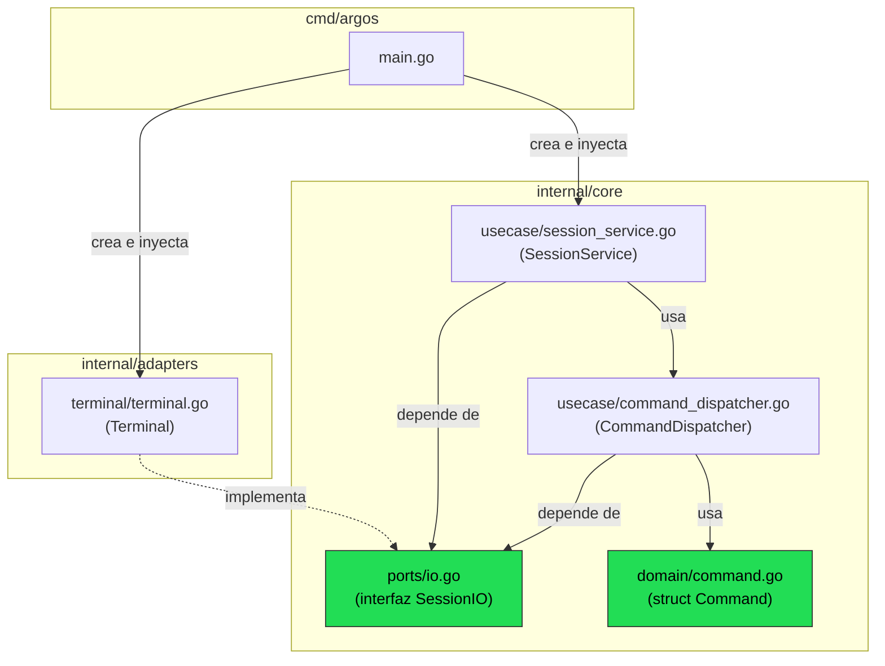
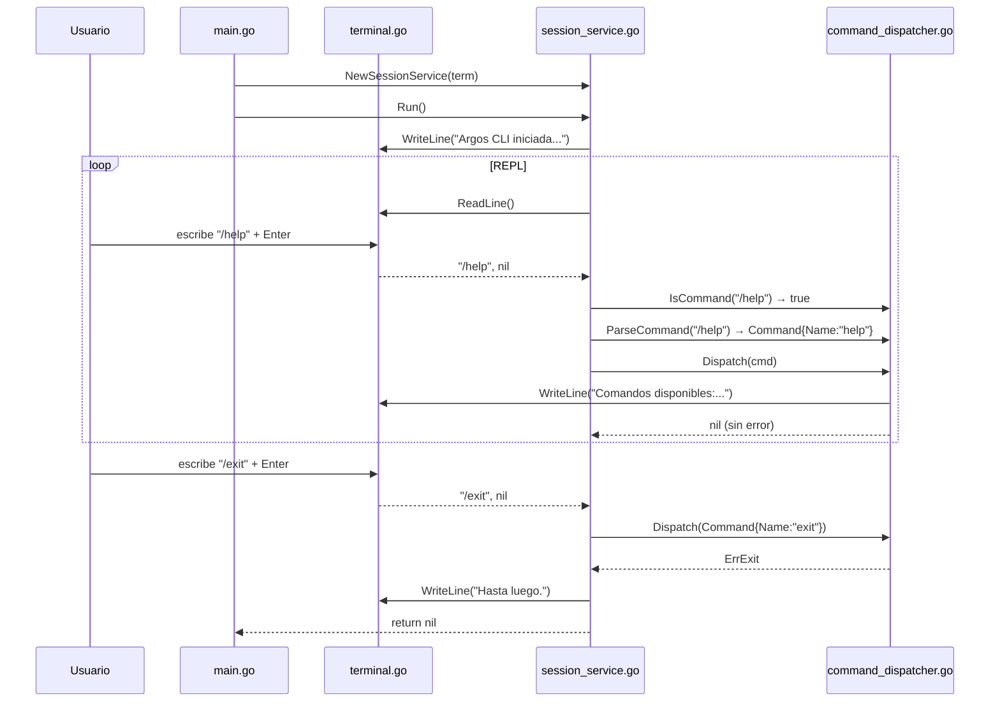

# Fase 1 — Fundamentos y estructura base (Días 1–4)

> Documento de trabajo bajo metodología SDD. Complementa a `project_description.md` (fuente de verdad del proyecto).
> **Estado: Fase 1 completada.**

---

## 1. Decisión de arquitectura

**Arquitectura Hexagonal (Ports & Adapters)**, sin las capas adicionales de Clean, con vocabulario ligero de dominio tomado de DDD donde aporte legibilidad (sin agregados ni value objects formales).

**Justificación:** el problema central de Argos no es modelar un dominio de negocio complejo, sino aislar el core conversacional (parseo de comandos, orquestación de sesión) de un conjunto de integraciones externas que van a cambiar con el tiempo: Ollama hoy, otro backend de modelos mañana; terminal hoy, posible socket/API para el módulo móvil después; sin voz hoy, con STT/TTS en la Fase 4. Hexagonal resuelve esto con el mínimo de ceremonia y es idiomático en Go (interfaces pequeñas + inyección de dependencias explícita en `main.go`, sin frameworks de DI).

### Estructura de carpetas (real, validada en esta fase)

```
argos/
├── cmd/
│   └── argos/
│       └── main.go
├── configs/
├── docs/
├── internal/
│   ├── adapters/
│   │   ├── config/
│   │   ├── ollama/
│   │   ├── scanner/
│   │   ├── terminal/
│   │   │   └── terminal.go
│   │   └── voice/
│   ├── core/
│   │   ├── domain/
│   │   │   └── command.go
│   │   ├── ports/
│   │   │   └── io.go
│   │   └── usecase/
│   │       ├── session_service.go
│   │       └── command_dispatcher.go
│   └── platform/
├── specs/
└── go.mod
```

**Regla de dependencia:** `core` no importa nada de `adapters`. Los `adapters` implementan las interfaces definidas en `core/ports`. `cmd/argos/main.go` es el único punto que conoce e inyecta las implementaciones concretas.

---

## 2. Checklist Fase 1 (Días 1–4)

- [x] Definir arquitectura general del proyecto (paquetes, estructura de carpetas Go).
- [x] Configurar entorno de desarrollo (Go 1.26.4, módulos, dependencias base).
- [x] Implementar el comando `argos` y el loop interactivo (REPL) básico.
- [x] Implementar sistema base de comandos slash (`/help`, `/exit`, `/clear`).

**Fase 1 cerrada.** Siguiente: Fase 2 — Integración con modelos locales (detección Ollama, `/model`, `/models list`).

---

## 3. Documentación del código implementado

Esta sección explica **qué hace cada archivo**, **por qué existe en esa capa** y **los puntos de Go que no son obvios a primera vista** (librerías estándar, patrones de manejo de errores, etc.). Está pensada para poder retomar el proyecto sin tener que releer el código línea por línea.

### 3.1 `internal/core/ports/io.go` — el contrato

**Responsabilidad:** define *qué* necesita el core para hablar con el usuario, sin decir *cómo*. Es una interfaz Go: un conjunto de métodos sin implementación.

```go
type SessionIO interface {
	ReadLine() (string, error)
	WriteLine(msg string)
	Close() error
}
```

**Por qué existe:** esta es la pieza central de la arquitectura hexagonal. El `core` (usecases) solo conoce esta interfaz, nunca `os.Stdin` ni `fmt.Println` directamente. Esto significa que en la Fase 4, cuando agreguemos voz, o más adelante si exponemos un socket para el módulo móvil, esas nuevas implementaciones (`voice.Voice`, `mobile.Socket`, etc.) solo tienen que cumplir esta misma interfaz — el `core/usecase` **no cambia ni una línea**.

**Punto clave de Go:** una interfaz en Go se satisface *implícitamente*. No hay un `implements` explícito como en Java/C#: cualquier tipo que tenga los tres métodos (`ReadLine`, `WriteLine`, `Close`) con esas firmas exactas ya es un `SessionIO` válido, sin declararlo. Por eso `terminal.Terminal` (sección 3.2) no menciona `ports.SessionIO` en ningún lado — el compilador lo verifica solo en el punto donde se usa (en `main.go`).

---

### 3.2 `internal/adapters/terminal/terminal.go` — la implementación concreta

**Responsabilidad:** implementar `SessionIO` usando la terminal real (stdin/stdout). Es el único archivo del proyecto que toca `os.Stdin`.

```go
type Terminal struct {
	scanner *bufio.Scanner
}
```

**`bufio.Scanner`:** Go no tiene una función "leer una línea" incorporada de forma directa y cómoda. `bufio` (buffered I/O) envuelve una fuente de datos (aquí, `os.Stdin`) y añade un buffer interno para leer de forma eficiente en trozos, en vez de byte por byte. `Scanner` además ya sabe partir la entrada en líneas por defecto (usa `\n` como separador internamente).

El patrón de uso es siempre el mismo par de llamadas:
```go
scanner.Scan()       // avanza y lee la siguiente línea; devuelve false si no hay más
scanner.Text()       // devuelve la línea leída como string (sin el salto de línea)
```

**Manejo de fin de entrada (`io.EOF`):**
```go
func (t *Terminal) ReadLine() (string, error) {
	if !t.scanner.Scan() {
		if err := t.scanner.Err(); err != nil {
			return "", err
		}
		return "", io.EOF
	}
	return strings.TrimSpace(t.scanner.Text()), nil
}
```
Cuando `Scan()` devuelve `false`, hay dos posibilidades: (a) ocurrió un error real de lectura, que `scanner.Err()` expone, o (b) simplemente se acabó la entrada (el usuario cerró la terminal, o hizo `Ctrl+Z` + Enter en Windows). El caso (b) **no es un error de Go en sí**, pero necesitamos poder distinguirlo del caso "el usuario escribió algo". Por convención en Go, se usa el valor especial `io.EOF` (End Of File) para señalar justamente eso: "no hay más datos, y no es un fallo". El `SessionService` (3.4) lo intercepta explícitamente para cerrar la sesión con un mensaje limpio en vez de tratarlo como un error real.

**`strings.TrimSpace`:** limpia espacios/tabs al inicio y final de la línea leída (por ejemplo, si el usuario escribe `"  /help  "`), para que la comparación de comandos no falle por espacios accidentales.

---

### 3.3 `internal/core/domain/command.go` — la entidad

**Responsabilidad:** representar un comando slash ya interpretado, independiente de cómo llegó el texto crudo.

```go
type Command struct {
	Name string
	Args []string
}
```

Ejemplo: `/model llama3 --verbose` se convierte en `Command{Name: "model", Args: ["llama3", "--verbose"]}`. Es deliberadamente mínima — no tiene lógica, es solo una estructura de datos (esto es lo que en DDD se llamaría un value object simple, sin la ceremonia formal de DDD que descartamos en la decisión de arquitectura).

---

### 3.4 `internal/core/usecase/command_dispatcher.go` — el enrutador de comandos

**Responsabilidad:** interpretar texto crudo como comando (`ParseCommand`), y ejecutar la acción correspondiente (`Dispatch`).

**`IsCommand` / `ParseCommand` como funciones libres:** no son métodos de `CommandDispatcher` porque no necesitan su estado (`io`) — son funciones puras (mismo input, mismo output, sin efectos secundarios), lo cual las hace más fáciles de probar de forma aislada en un test unitario, sin necesidad de crear un `CommandDispatcher` completo.

```go
func ParseCommand(line string) domain.Command {
	trimmed := strings.TrimPrefix(line, "/")
	fields := strings.Fields(trimmed)
	...
}
```
**`strings.Fields`:** parte un string por espacios en blanco (uno o varios, tabs incluidos) y descarta los vacíos. Es la forma idiomática en Go de "tokenizar" una línea sin tener que lidiar manualmente con espacios dobles o similares. `"/model   llama3"` y `"/model llama3"` producen el mismo resultado.

**El patrón `ErrExit` — señalizar "salir" como un error especial:**
```go
var ErrExit = errors.New("sesión terminada por comando")
```
Esto puede parecer raro: ¿por qué "salir de la sesión" es un `error`? En Go es un patrón común usar el tipo `error` como canal de señalización de control, no solo para fallos reales. `ErrExit` no significa que algo salió mal — significa "el flujo normal debe interrumpirse aquí, y el llamador debe saberlo". La alternativa sería añadir un segundo valor de retorno tipo `bool` (`shouldExit bool`) a `Dispatch`, pero encadenar señales de control como errores es el idioma más extendido en la comunidad Go cuando la señal se propaga a través de varias capas de llamadas.

**`errors.Is` para detectar esa señal:**
```go
if err := d.dispatcher.Dispatch(cmd); err != nil {
	if errors.Is(err, ErrExit) {
		// salida limpia
	}
	return err // error real, se propaga
}
```
`errors.Is` compara si un error *es* (o *envuelve a*) otro error específico. Aquí se usa en vez de un simple `err == ErrExit` porque es la forma robusta recomendada en Go moderno: sigue funcionando aunque en el futuro `ErrExit` se envuelva con contexto adicional (`fmt.Errorf("comando: %w", ErrExit)`), cosa que una comparación directa con `==` rompería.

**El `switch` de comandos:**
```go
func (d *CommandDispatcher) Dispatch(cmd domain.Command) error {
	switch cmd.Name {
	case "help":
		d.help()
	case "exit", "quit":
		return ErrExit
	case "clear":
		d.clear()
	...
	}
	return nil
}
```
Es el punto de extensión para RF-10: cada nuevo comando (`/model`, `/scan`, `/config`, etc. en fases posteriores) se agrega como un `case` adicional. `/clear` por ahora es un **stub** (mensaje sin lógica real) porque limpiar historial de verdad requiere que `SessionService` mantenga estado de conversación (`domain.Session`/`domain.Message`), lo cual corresponde a RF-08 en Fase 3 — se dejó anotado con `TODO(fase 3)` en el código para no perder ese pendiente.

---

### 3.5 `internal/core/usecase/session_service.go` — el orquestador del loop

**Responsabilidad:** mantener viva la sesión interactiva (REPL: Read-Eval-Print-Loop), decidiendo para cada línea leída si es un comando o texto libre, y delegando en consecuencia.

```go
type SessionService struct {
	io         ports.SessionIO
	dispatcher *CommandDispatcher
}
```

Nótese que `SessionService` depende de `ports.SessionIO` (la interfaz), **no** de `terminal.Terminal` (la implementación concreta). Esta es la inversión de dependencias propia de la arquitectura hexagonal: el core define el contrato, el adapter lo cumple, y quien los conecta es `main.go`.

```go
for {
	line, err := s.io.ReadLine()
	if err != nil {
		if errors.Is(err, io.EOF) {
			s.io.WriteLine("Sesión finalizada (EOF).")
			return nil
		}
		return err
	}
	...
}
```
El loop `for {}` sin condición es un bucle infinito explícito en Go (equivalente a `while(true)` en otros lenguajes) — se rompe únicamente con `return`. Cada vuelta lee una línea; si el error es `io.EOF`, se interpreta como cierre normal de sesión (no se propaga como fallo). Cualquier otro error sí se propaga hacia `main.go`, donde se reporta y el programa termina con código de salida distinto de cero.

---

### 3.6 `cmd/argos/main.go` — el wiring

**Responsabilidad:** el único lugar del proyecto que conoce tanto las interfaces (`ports`) como las implementaciones concretas (`adapters`). Aquí se "conectan los cables": se crea el `terminal.Terminal` y se lo pasa a `usecase.NewSessionService`, que internamente solo ve un `ports.SessionIO`.

```go
term := terminal.New()
defer term.Close()

session := usecase.NewSessionService(term)

if err := session.Run(); err != nil {
	fmt.Fprintln(os.Stderr, "error:", err)
	os.Exit(1)
}
```

**`defer term.Close()`:** `defer` pospone la ejecución de esa línea hasta que la función `main` termine (por cualquier vía: return normal o panic). Es el patrón estándar de Go para garantizar liberación de recursos — hoy `Close()` no hace nada (la terminal no requiere limpieza), pero cuando el adapter de voz necesite cerrar un stream de audio, el patrón ya está listo sin tocar `main.go`.

**`os.Exit(1)`:** si `Run()` devuelve un error real (no `io.EOF`, que ya se maneja dentro del loop), se imprime a `stderr` (no a `stdout`, para no mezclar errores con salida normal) y el proceso termina con código 1, señal estándar de fallo para scripts o el propio usuario.

---

## 4. Diagrama de flujo — interacción entre archivos

### 4.1 Dependencias entre capas (arquitectura hexagonal en la práctica)

Muestra quién importa a quién. Las flechas van en el sentido de la importación.



**Lectura clave:** `core` (verde) nunca apunta hacia `adapters`. La única flecha que cruza esa frontera es la de `TERM -.implementa.-> PORTS`, y es una implementación (el adapter cumple el contrato), no una dependencia de importación real — `terminal.go` ni siquiera menciona el paquete `usecase`. Quien conecta ambos mundos es exclusivamente `main.go`.

### 4.2 Secuencia de una interacción típica (usuario escribe `/help`)

Muestra el orden temporal de llamadas entre archivos para un ciclo completo del REPL.



**Lectura clave:** `session_service.go` es el único que orquesta el orden de llamadas; `terminal.go` y `command_dispatcher.go` nunca se llaman entre sí directamente. Esto es lo que permite, por ejemplo, que en Fase 4 un adapter de voz reemplace a `terminal.go` sin que `command_dispatcher.go` se entere del cambio.

---

## 5. Conclusión de la Fase 1

Al cierre de esta fase, Argos CLI cuenta con una base funcional mínima pero completa: un binario que compila para `windows/amd64`, arranca un REPL real (no un placeholder), y reconoce un primer conjunto de comandos slash (`/help`, `/clear`, `/exit`, `/quit`) sobre una arquitectura hexagonal ya validada con código real, no solo en el papel.

Lo más importante de esta fase no es el volumen de código —deliberadamente pequeño— sino que **la frontera entre `core` y `adapters` quedó probada en la práctica**: `session_service.go` y `command_dispatcher.go` no conocen `os.Stdin`, `bufio.Scanner` ni ningún detalle de terminal; solo hablan con la interfaz `ports.SessionIO`. Esto confirma que la decisión de arquitectura documentada en la sección 1 no era solo una preferencia teórica, sino que resuelve el problema real que se planteó: aislar el core conversacional de integraciones externas reemplazables. El diagrama de la sección 4.1 es la evidencia visual de esa separación.

Quedan pendientes intencionalmente fuera de alcance de esta fase (no son deuda técnica, son secuencia correcta según SDD):
- `/clear` es un stub — el historial real de conversación (RF-08) requiere las entidades `domain.Session`/`domain.Message`, que corresponden a Fase 3.
- No hay todavía ningún `ModelProvider` ni conexión con Ollama — eso es exactamente el objetivo de Fase 2.
- No se agregó el flag `--path` (RF-12) para no mezclar alcance; se retoma cuando se implemente carga de contexto de proyecto.

Con los cuatro ítems del checklist cerrados y la arquitectura validada con código funcionando, el proyecto está listo para avanzar a **Fase 2 — Integración con modelos locales**.

---

## 6. Notas / próximos pasos

- Fase 1 completa: REPL funcional + sistema base de slash commands (`/help`, `/clear`, `/exit`, `/quit`) sobre arquitectura hexagonal validada.
- Pendiente explícito para Fase 3 (no Fase 2): `/clear` real requiere `domain.Session`/`domain.Message` con historial — no se implementó aún a propósito, para no anticipar entidades sin uso (ver TODO en `command_dispatcher.go`).
- **Siguiente paso — Fase 2:** implementar detección automática de modelos vía Ollama (RF-02). Esto añade:
  - Un nuevo port en `core/ports` (ej. `ModelProvider`) con métodos tipo `ListModels()`.
  - Su implementación en `internal/adapters/ollama/`.
  - Nuevos comandos `/model` y `/models list` en `command_dispatcher.go`, siguiendo el mismo patrón de `case` ya establecido.
- Este documento se actualiza en cada sesión conforme avance el desarrollo; no reemplaza a `project_description.md`, lo complementa con el detalle de ejecución de cada fase.