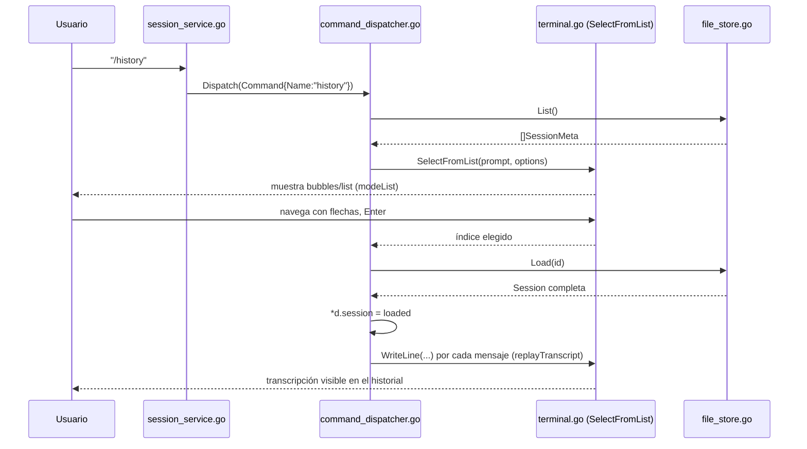

# Fase 3 — Chat interactivo y contexto de proyecto (Días 9–12)

> Documento de trabajo bajo metodología SDD. Complementa a `project_description.md`
> (fuente de verdad) y a `phase_two.md` (Fase 2, ya cerrada). Se abre este archivo
> al completar el primer ítem del checklist de Fase 3; se sigue actualizando a
> medida que avanzan los ítems restantes, y se cierra formalmente (como
> `phase_one.md`/`phase_two.md`) cuando los cuatro estén hechos.

**Estado: en progreso — checklist 1/4 completado.**

---

## 1. Checklist Fase 3

- [x] Implementar historial de conversación persistente (`/history`).
- [ ] Implementar `/init` (selección interactiva de modelo + generación de `ARGOS.md`, `--path`).
- [ ] Implementar comando `/scan` para auditoría de código.
- [ ] Implementar generación de reportes de auditoría exportables.

**Siguiente:** `/init` — reutiliza el mismo componente de selección interactiva
construido para `/history` (ver §6), esta vez para elegir modelo antes de
generar `ARGOS.md`.

---

## 2. Resumen de la sesión (checklist 1 — `/history`)

Esta sesión implementó de punta a punta RF-08 (historial persistente de
conversación) y resolvió, como consecuencia directa, dos pendientes que
venían arrastrándose desde fases anteriores:

- El pendiente de `phase_two.md` §8: `activeModel` deja de vivir como campo
  suelto en `CommandDispatcher` y pasa a `domain.Session`, dueña ahora
  `SessionService`.
- El `TODO(fase 3)` de `phase_one.md` §3.4: `/clear` deja de ser un stub.

También se resolvió, dentro de esta misma sesión y como parte del mismo
checklist (no como ítem aparte — decisión tomada explícitamente con Javier),
un vacío detectado después de la primera implementación: al cargar una
conversación con `/history`, el modelo recuperaba el contexto correctamente
en memoria, pero la transcripción no se veía en pantalla. Se agregó
`replayTranscript()` para reimprimir los mensajes cargados en el historial
visual de la terminal.

**Decisión que queda cerrada en esta sesión:** la selección interactiva con
`bubbles/list` sobre el mismo `tea.Program` de Fase 2.5, que en
`project_description.md` §6 figuraba como "candidato", queda confirmada como
la forma de selección para `/history` — y por extensión, la que va a
reutilizar `/init` para elegir modelo (mismo componente, un solo lugar de
mantenimiento).

**Pendiente sin resolver, heredado de Fase 2 (no se tocó en esta sesión):**
`phase_two.md` marca `/ollama init` y la interfaz `ModelBackendStarter` como
completados, pero no están en el código real (`command_dispatcher.go` no
tiene ese `case`, `ports/model_provider.go` no tiene esa interfaz). Sigue
pendiente que Javier confirme si es código que no se pusheó o si el doc hay
que corregirlo.

---

## 3. Estructura de carpetas (cambios)

```
argos/
├── cmd/
│   └── argos/
│       └── main.go                        [modificado]
├── internal/
│   ├── adapters/
│   │   ├── storage/
│   │   │   └── file_store.go              [nuevo]
│   │   └── terminal/
│   │       ├── model.go                   [modificado]
│   │       └── terminal.go                [modificado]
│   └── core/
│       ├── domain/
│       │   └── session.go                 [nuevo]
│       ├── ports/
│       │   ├── history_store.go           [nuevo]
│       │   └── io.go                      [modificado]
│       └── usecase/
│           ├── command_dispatcher.go      [modificado]
│           ├── history.go                 [nuevo]
│           └── session_service.go         [modificado]
├── .gitignore                             [modificado: + /.argos/]
└── go.mod                                 [sin cambios — bubbles/list ya estaba desde 2.5]
```

Regla de dependencia sin cambios: `core` sigue sin importar `adapters`.
`storage` es el único paquete que sabe que la persistencia es, en concreto,
"un JSON por sesión en `.argos/sessions/`" — el core solo conoce
`ports.HistoryStore`.

---

## 4. Documentación del código implementado

### 4.1 `internal/core/domain/session.go` — las entidades

**Responsabilidad:** representar una conversación completa (`Session`) y
cada turno individual (`Message`), además de dos tipos de soporte:
`SessionMeta` (vista liviana para listar sin cargar mensajes) y `ListOption`
(entrada genérica para selección interactiva, pensada para reusarse en
`/init`).

`NewSession()` genera un ID basado en timestamp + 4 bytes aleatorios
(`crypto/rand`), sin librería de UUID externa — coherente con RNF-04
(mantener el árbol de dependencias mínimo).

`ActiveModel` vive acá desde esta fase, no en `CommandDispatcher` (ver
decisión en §6).

### 4.2 `internal/core/ports/history_store.go` — el contrato de persistencia

**Responsabilidad:** define qué necesita el core para guardar/listar/cargar
conversaciones, sin saber que detrás hay archivos JSON. Tres métodos
(`Save`, `List`, `Load`), mismo criterio de Fase 2 de interfaces chicas
en vez de una interfaz "gorda".

### 4.3 `internal/core/ports/io.go` — extensión de `SessionIO`

**Cambio:** se agregó `SelectFromList(prompt string, options []domain.ListOption) (int, error)`
al contrato existente, más el sentinel `ErrSelectionCancelled` (mismo patrón
que `ErrExit`: no es un error real, es una señal de control para distinguir
"el usuario canceló" de "algo falló de verdad").

**Por qué en `SessionIO` y no en una interfaz nueva:** es, conceptualmente,
otra forma de interactuar con el usuario — mismo criterio que ya agrupa
`ReadLine`/`WriteLine`. Al día de hoy solo `terminal.Terminal` la implementa
(no hay otro adapter todavía), así que agregar un método a la interfaz no
rompió nada, pero hay que tenerlo presente: el día que exista un adapter de
voz (Fase 4), también va a tener que resolver qué significa "seleccionar de
una lista" por voz.

### 4.4 `internal/core/usecase/command_dispatcher.go` — cambios centrales

**`activeModel` desaparece como campo.** `CommandDispatcher` ahora guarda un
`session *domain.Session` (puntero, no valor — ver la explicación de
punteros en §7) que le inyecta `SessionService`. Todo lo que antes leía/
escribía `d.activeModel` ahora lee/escribe `d.session.ActiveModel`.

**`historyCmd()` — nuevo, implementa `/history`:**
1. Pide la lista liviana a `d.history.List()`.
2. Arma `[]domain.ListOption` con título, fecha formateada y resumen.
3. Bloquea en `d.io.SelectFromList(...)` esperando que el usuario elija (o
   cancele).
4. Carga la sesión completa con `d.history.Load(id)`.
5. `*d.session = loaded` — importante: no es `d.session = &loaded`. Eso
   reemplazaría el puntero que apunta `CommandDispatcher`, pero
   `SessionService` seguiría apuntando al `Session` viejo (cada uno tendría
   su propio puntero). `*d.session = loaded` en cambio escribe el contenido
   de `loaded` **en la misma dirección de memoria** que ya comparten los
   dos — así ambos ven la sesión cargada.
6. Llama a `replayTranscript()` (ver 4.4.1).

**`replayTranscript()` — agregado al final de la sesión, mismo checklist:**
recorre `d.session.Messages` y reimprime cada uno por `d.io.WriteLine(...)`
con prefijo `"Vos: "` o `"Argos: "` según el rol. No toca nada de
`terminal/model.go` — el historial visual (`viewport`) es un `[]string`
aparte (ver `intermediate_phases.md`, notas de Fase 2.5) que se llena
exclusivamente vía `WriteLine`, así que reproducir la transcripción por ese
mismo canal alcanza sin romper la frontera hexagonal.

**`clear()` — deja de ser stub:** ahora hace `d.session.Messages = nil`.
No toca `ActiveModel` ni lo ya persistido en `.argos/sessions/` — solo el
historial en memoria de la conversación en curso.

**`HandlePrompt()` — modificado:** además de llamar a `Generate`, ahora
appendea el turno del usuario y la respuesta del modelo a
`d.session.Messages`, para que quede algo que persistir cuando la sesión
termine.

### 4.5 `internal/core/usecase/history.go` — resumen automático

**Responsabilidad:** `summarizeSession()` completa `Title`/`Summary` de la
sesión antes de guardarla, pidiéndole al modelo activo un resumen en un
formato fijo (`Titulo: ...` / `Resumen: ...`). Si no hay modelo activo, la
llamada falla, o la respuesta no viene parseable, cae a un fallback (primer
mensaje del usuario truncado). Necesario en la práctica: modelos chicos
(0.5B–3B, ver `phase_two.md` §7) no siempre respetan instrucciones de
formato.

### 4.6 `internal/core/usecase/session_service.go` — dueña de la sesión

**Cambio de rol:** `SessionService` ahora crea la `Session` (`domain.NewSession()`)
y se la pasa por puntero a `CommandDispatcher` al construirlo — los dos
`usecase` comparten la misma instancia en memoria durante toda la sesión.

**`persistSession()` — nuevo:** se llama al cerrar (`/exit`, `/quit`, o EOF).
Si `Session.Messages` está vacío, no guarda nada (evita ensuciar
`.argos/sessions/` con sesiones donde el usuario no escribió nada). Si hay
contenido, llama a `summarizeSession` y después a `d.history.Save(...)`.

### 4.7 `internal/adapters/storage/file_store.go` — la persistencia real

**Responsabilidad:** único adapter que sabe que "guardar una sesión" es
"escribir un `.json` en `.argos/sessions/`". `New(root)` crea el directorio
si no existe (nunca en `$HOME`, RNF-08). `List()` ignora archivos
individuales corruptos en vez de abortar todo el listado (degradación con
gracia, mismo criterio de RNF-06 que ya se usó en `ollama.go` en Fase 2).

### 4.8 `internal/adapters/terminal/model.go` y `terminal.go` — el picker

**El problema de diseño:** `bubbles/list` necesita su propio ciclo de vida
dentro del mismo `tea.Program` que ya maneja el chat — no se puede abrir un
segundo programa bubbletea en paralelo sin pelearse por la terminal.

**La solución — un `uiMode` (`modeChat` / `modeList`):** el `model` de
bubbletea gana un campo `mode`. Cuando está en `modeList`, las teclas
(flechas, Enter, Esc) se enrutan al componente `list.Model` en vez de al
`textinput`; el `View()` dibuja la lista en vez del viewport+input.

**El puente de vuelta hacia `CommandDispatcher` — mismo patrón que
`ReadLine`:** `Terminal.SelectFromList()` manda un `showListMsg` (que
incluye el propio canal de respuesta) al programa vía `prog.Send()`, y
bloquea leyendo ese canal hasta que `Update()` procese un Enter o un Esc.

### 4.9 `cmd/argos/main.go` — wiring

**Cambio:** se agrega `storage.New(root)` con `root = os.Getwd()`, y se
inyecta como cuarto parámetro de `NewSessionService`. `--path` (RF-12)
queda pendiente para el checklist de `/init`, así que por ahora la raíz del
historial siempre es el directorio desde el que se corre `argos`.

---

## 5. Diagrama de flujo — `/history`



---

## 6. Decisiones de diseño relevantes

- **`bubbles/list` queda confirmado** como mecanismo de selección
  interactiva (dejó de ser "candidato" en `project_description.md` §6).
  `/init` va a reutilizar el mismo `SelectFromList` para elegir modelo.
- **`activeModel` en `Session`, no en `CommandDispatcher`:** resuelve el
  pendiente arquitectónico de `phase_two.md` §8. `SessionService` es la
  dueña del ciclo de vida; `CommandDispatcher` opera sobre un puntero
  compartido.
- **Sesiones vacías no se persisten:** si el usuario abre y cierra `argos`
  sin escribir nada, no se crea archivo en `.argos/sessions/`.
- **Resumen "mejor esfuerzo":** dado el hardware CPU-bound de destino y los
  modelos chicos, se prioriza que `/history` nunca falle por un resumen mal
  formado, aunque eso signifique un título genérico en el peor caso.
- **Raíz del historial = directorio de trabajo actual**, no `--path`
  todavía — evita mezclar alcance con el checklist de `/init`, que es donde
  corresponde RF-12 según el propio cronograma.

---

## 7. Sintaxis útil de Go (glosario de esta sesión)

Iba surgiendo código con patrones de Go que vale la pena tener documentados
acá para no tener que re-explicarlos en cada sesión futura.

**Receptor por puntero vs. por valor**
```go
func (d *CommandDispatcher) clear() { d.session.Messages = nil }
```
`d` es el "self" del método — no hay nada mágico en el nombre, se elige. La
diferencia entre `(d CommandDispatcher)` y `(d *CommandDispatcher)` es si Go
te da una copia del struct o una referencia a la original. Como varios
métodos necesitan mutar estado real (`d.session.ActiveModel = name`, por
ejemplo), el tipo entero usa receptor por puntero, por consistencia.

**El operador `*` tiene dos significados según el contexto**
- En una declaración de tipo (`session *domain.Session`): "puntero a".
- Delante de una variable que ya es puntero (`*d.session = loaded`):
  "escribí en la dirección de memoria a la que apunta esta variable" (se
  llama *dereferenciar*). Por eso `*d.session = loaded` actualiza la sesión
  compartida en memoria, en vez de reemplazar el puntero.

**Interfaces satisfechas implícitamente**
```go
type SessionIO interface { WriteLine(msg string); ... }
```
No existe `implements` en Go. Cualquier tipo que tenga los métodos con esa
firma exacta ya cumple la interfaz, sin declararlo — por eso `terminal.go`
no menciona `ports.SessionIO` en ningún lado.

**`for _, m := range slice`**
`range` sobre un slice devuelve índice y valor en cada vuelta. El `_` es el
*blank identifier*: "no me interesa este valor, ni le pongas nombre". Go
obliga a usar toda variable declarada — sin el `_`, declarar el índice y no
usarlo sería error de compilación.

**`switch` sin `break`**
```go
switch m.Role {
case "user":
    ...
case "assistant":
    ...
}
```
A diferencia de C/Java, cada `case` termina solo — no hay *fallthrough*
implícito, así que no hace falta (ni se estila) poner `break`.

**Canales como puente entre goroutines (`chan<-` / `<-chan`)**
```go
resultCh := make(chan selectResult, 1)
t.prog.Send(showListMsg{..., result: resultCh})
select {
case r := <-resultCh:
    return r.index, r.err
case <-t.doneCh:
    return -1, ports.ErrSelectionCancelled
}
```
`chan<- T` es un canal en el que solo se puede *enviar*; `<-chan T` uno del
que solo se puede *recibir* — restringir la dirección en la firma de una
función es la forma que tiene Go de decir "esta función solo debería poder
mandar acá, no leer" (o viceversa), y el compilador lo hace cumplir.
`select` con dos `case` espera al primero que esté listo — acá, "llegó la
respuesta" o "el programa se cerró", lo que pase primero.

**`errors.Is` y sentinels de control**
```go
var ErrSelectionCancelled = errors.New("...")
...
if errors.Is(err, ports.ErrSelectionCancelled) { ... }
```
Un *sentinel error* es un valor de error predefinido que no representa una
falla real, sino una señal ("el usuario canceló", "hay que salir"). Se usa
`errors.Is` en vez de `==` porque sigue funcionando aunque el error se
envuelva con contexto extra más adelante (`fmt.Errorf("...: %w", err)`).

**Tags de struct para JSON**
```go
type Message struct {
    Role    string    `json:"role"`
    Content string    `json:"content"`
}
```
El texto entre comillas invertidas después de cada campo es metadata que
lee `encoding/json` en tiempo de ejecución (vía *reflection*) para decidir
cómo nombrar esa clave al serializar/deserializar. Sin el tag, Go usaría el
nombre del campo tal cual (`Role`, con mayúscula) en el JSON.

---

## 8. Pendiente / notas para la próxima sesión

- **Confirmar el estado de `/ollama init`** (discrepancia heredada de
  `phase_two.md`, sin resolver todavía).
- **Siguiente checklist:** `/init` — selección de modelo (reutilizando
  `SelectFromList`), recorrido de archivos vía `internal/adapters/scanner/`
  (carpeta vacía desde Fase 1), generación de `ARGOS.md`, y resolución de
  `--path` (RF-12).
- Este documento se sigue actualizando a medida que avancen los próximos
  ítems del checklist; no reemplaza a `project_description.md`.
