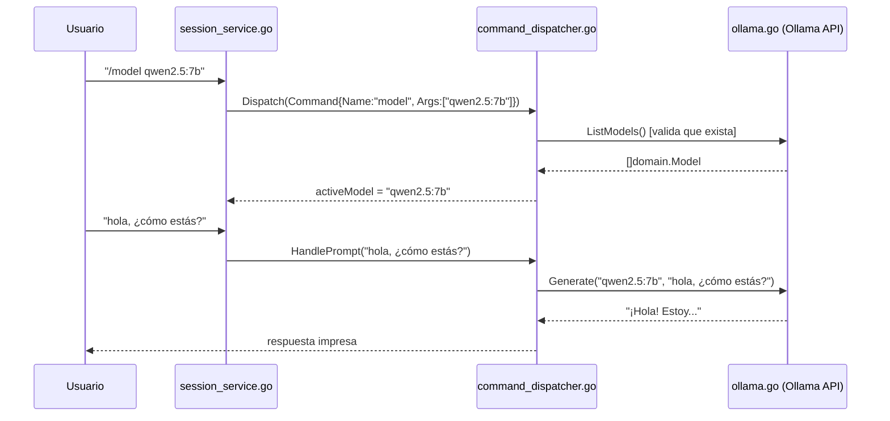

# Fase 2 — Integración con modelos locales (Días 5–8)

> Documento de trabajo bajo metodología SDD. Complementa a `project_description.md` (fuente de verdad) y a `phase_one.md` (Fase 1, ya cerrada).
> **Estado: Fase 2 completada.**

---

## 1. Checklist Fase 2

- [x] Implementar detección automática de modelos instalados vía Ollama (RF-02).
- [x] Implementar comando `/model` y `/models list` (RF-03, RF-10).
- [x] Establecer comunicación básica CLI ↔ modelo local (envío/recepción de prompts) (RF-04).
- [x] Manejo de errores cuando Ollama no está corriendo o no hay modelos disponibles (RNF-06).

**Extra agregado (no estaba en la lista inicial de RF-10, que se define ahí mismo como "propuesta inicial"):**
- [x] `/ollama init` — arranca Ollama automáticamente si no está corriendo.

**Fase 2 cerrada.** Siguiente: Fase 3 — Chat interactivo y contexto de proyecto.

---

## 2. Estructura de carpetas (actualizada)

```
argos/
├── cmd/
│   └── argos/
│       └── main.go                       [modificado]
├── internal/
│   ├── adapters/
│   │   ├── ollama/
│   │   │   └── ollama.go                 [nuevo]
│   │   └── terminal/
│   │       └── terminal.go
│   └── core/
│       ├── domain/
│       │   ├── command.go
│       │   └── model.go                  [nuevo]
│       ├── ports/
│       │   ├── io.go
│       │   └── model_provider.go         [nuevo]
│       └── usecase/
│           ├── session_service.go        [modificado]
│           └── command_dispatcher.go     [modificado]
└── go.mod
```

Regla de dependencia sin cambios: `core` no importa `adapters`. `ollama` es el único paquete que sabe que el backend concreto es Ollama; `core` solo conoce las interfaces de `ports`.

---

## 3. Archivos nuevos

### 3.1 `internal/core/domain/model.go`
Entidad `Model`: nombre, tamaño en bytes, y si está cargado en memoria (`Loaded`). Sin lógica — value object simple, mismo criterio que `Command` en Fase 1.

### 3.2 `internal/core/ports/model_provider.go`
Tres interfaces, deliberadamente separadas (no una sola interfaz gorda):

- **`ModelProvider`** — `ListModels() ([]domain.Model, error)`. Contrato mínimo para detectar modelos.
- **`ModelBackendStarter`** — `Start() error`. Puerto **opcional**: no todo backend tiene sentido de "arrancar" (uno remoto no). El dispatcher hace type-assertion sobre esta interfaz en vez de exigirla en `ModelProvider`.
- **`ModelRunner`** — `Generate(model, prompt string) (string, error)`. Contrato para enviar un prompt y recibir la respuesta completa.

**Por qué tres interfaces y no una:** mismo principio de Fase 1 (interfaces chicas). `ollama.Client` termina implementando las tres, pero el core nunca lo sabe — solo ve los métodos que necesita en cada punto de uso.

### 3.3 `internal/adapters/ollama/ollama.go`
Único adapter que habla HTTP con Ollama (`http://localhost:11434`). Implementa `ModelProvider`, `ModelBackendStarter` y `ModelRunner`.

**Dos `http.Client` con timeouts distintos:**
```go
type Client struct {
    baseURL string
    http    *http.Client // 5s  — /api/tags, /api/ps (chequeos rápidos)
    genHTTP *http.Client // 5min — /api/generate (la inferencia puede tardar)
}
```
Usar el mismo cliente con timeout corto para `/api/generate` cortaría respuestas de modelos lentos/CPU-only a mitad de camino.

**Endpoints usados:**
| Método | Endpoint | Uso |
|---|---|---|
| `GET` | `/api/tags` | Modelos descargados (disponibles) |
| `GET` | `/api/ps` | Modelos cargados en memoria ahora mismo |
| `POST` | `/api/generate` | Enviar prompt, `stream:false`, recibir respuesta completa |

**`ListModels()`:** combina `/api/tags` + `/api/ps`. Si `/api/ps` falla, no aborta — sigue con la lista de `/api/tags` marcando todo como no cargado (degradación con gracia, RNF-06).

**`Start()`:** si `/api/tags` ya responde, no hace nada. Si no, lanza `exec.Command("ollama", "serve")` como proceso desacoplado (`cmd.Process.Release()`, no se espera con `Wait()`) y hace polling cada 300ms hasta 10s.

**`Generate(model, prompt)`:** `POST /api/generate` con `{model, prompt, stream:false}`. Si Ollama devuelve status ≠ 200, intenta decodificar `{"error": "..."}` del body para dar un mensaje útil (ej. modelo inexistente) en vez de solo el código HTTP.

**Errores siempre envueltos con contexto accionable**, ej.: *"no se pudo conectar con Ollama en http://localhost:11434 (¿está corriendo? probá /ollama init)"* — nunca se propaga un error crudo de Go al usuario.

---

## 4. Archivos modificados

### 4.1 `internal/core/usecase/command_dispatcher.go`
**Nuevo estado de sesión:**
```go
type CommandDispatcher struct {
    io          ports.SessionIO
    models      ports.ModelProvider
    runner      ports.ModelRunner
    activeModel string // RF-03: vacío si no hay modelo seleccionado
}
```
`activeModel` vive acá (no en una entidad `domain.Session`) porque `CommandDispatcher` ya es una instancia por sesión — agregarle estado mutable no anticipa las entidades `domain.Session`/`domain.Message` que están pospuestas a Fase 3.

**Comandos nuevos (`Dispatch` switch):**
- `models` → `listModels()` — RF-02. Empty state con sugerencia de `ollama pull`. Formatea tamaño (`formatSize`: B/MB/GB) y estado (`disponible`/`cargado`).
- `model` → `model(args)` — RF-03. Sin args: muestra el activo. Con arg: valida contra `ListModels()` antes de aceptar (evita typos silenciosos) y lo fija.
- `ollama` → `ollamaInit(args)` — solo soporta `/ollama init`. Type-assert `d.models.(ports.ModelBackendStarter)`; si el backend no lo soporta, avisa en vez de fallar.

**Método nuevo fuera del switch — `HandlePrompt(text string)`:** RF-04. Llamado por `SessionService` para texto libre (no-comando). Si no hay `activeModel`, corta con mensaje claro. Si lo hay, llama `runner.Generate(activeModel, text)` y escribe la respuesta o el error.

### 4.2 `internal/core/usecase/session_service.go`
- Constructor gana el parámetro `runner ports.ModelRunner`.
- **Se eliminó el placeholder de eco de Fase 1** (`s.io.WriteLine("(echo) " + line)`). Texto libre ahora va a `s.dispatcher.HandlePrompt(line)`.

### 4.3 `cmd/argos/main.go`
```go
models := ollama.New()
session := usecase.NewSessionService(term, models, models)
```
`models` se inyecta dos veces porque el mismo `*ollama.Client` satisface tanto `ports.ModelProvider` como `ports.ModelRunner` (y `ModelBackendStarter`). Sigue siendo el único punto del proyecto que conoce el tipo concreto `ollama.Client`.

---

## 5. Flujo de una interacción típica



**Lectura clave:** `session_service.go` sigue sin conocer Ollama ni HTTP — solo distingue comando vs. texto libre y delega en `command_dispatcher.go`. Este último tampoco conoce HTTP: solo llama a las interfaces `ports.ModelProvider`/`ModelRunner`. Toda la lógica de red vive exclusivamente en `internal/adapters/ollama/ollama.go`. La frontera hexagonal validada en Fase 1 se sostuvo sin modificaciones al agregar todo esto.

---

## 6. Decisiones de diseño relevantes

- **Sin streaming.** `Generate` usa `stream:false`; la respuesta llega completa de una vez. Streaming (imprimir token a token) es mejora futura, no bloqueante para RF-04.
- **`activeModel` es estado en memoria de la sesión, no persistente.** Se pierde al cerrar Argos. `RF-11` (config persistente con modelo por defecto) es Fase 5, no Fase 2 — anotado como pendiente intencional, no deuda técnica.
- **`/model` valida contra la lista real antes de aceptar el cambio** — cuesta una llamada HTTP extra pero evita que la sesión quede apuntando a un nombre inexistente hasta el primer prompt fallido (RNF-05, usabilidad).
- **Interfaces opcionales vía type-assertion** (`ModelBackendStarter`) en vez de métodos obligatorios en `ModelProvider`: mantiene el contrato mínimo para backends que no necesiten "arrancar".

---

## 7. Validado durante esta fase

- `go build ./...` y `go vet ./...` sin errores.
- Test manual con servidor HTTP simulado (`httptest`) contra `ListModels()` y `Generate()` — confirma parseo correcto de `/api/tags`, `/api/ps` y `/api/generate`.
- Probado en la máquina Windows real de Javier con Ollama corriendo y dos modelos instalados (`qwen2.5:0.5b`, `smollm2:360m`): detección múltiple, cambio de modelo activo y generación de respuesta funcionando extremo a extremo.
- Confirmado que modelos muy pequeños (`smollm2:360m`, 360M parámetros) no sostienen instrucciones de idioma de forma confiable (responde en inglés a prompts en español) — limitación de capacidad del modelo, no un bug de integración.

---

## 8. Pendiente / notas para Fase 3

Fase 3 — Chat interactivo y contexto de proyecto (RF-08, RF-09, y parte de RF-13):

- **`domain.Session` / `domain.Message`**: no existen todavía. `activeModel` hoy vive suelto en `CommandDispatcher`; en Fase 3 probablemente se mueva a una estructura `Session` que también cargue el historial de mensajes. Repensar en ese momento si `CommandDispatcher` sigue siendo el dueño del estado de sesión o si pasa a `SessionService`.
- **`/clear` sigue siendo un stub** (`TODO(fase 3)` en el código) — limpiar historial real requiere que exista el historial primero.
- **`/history`** (RF-10) depende de lo mismo.
- **`/context` y `--path`** (RF-09, RF-12): cargar archivos/carpetas del proyecto como contexto para el modelo. Va a requerir decidir cómo se inyecta ese contexto en `Generate()` — probablemente extendiendo `generateRequest` con un campo de contexto o prompt-engineering en el texto enviado.
- **`/scan`** (RF-06/RF-07, auditoría de código): primer uso real del agente para su propósito central (auditoría/debugging, no generación). Probablemente combine lectura de archivos + `Generate()` con un prompt especializado.
- **Housekeeping pendiente:** agregar `argos.exe` a `.gitignore` — quedó comprometido en la raíz del repo y causó confusión al probar cambios (binario viejo tomando precedencia). No se resolvió todavía.

Este documento se actualiza al cierre de cada fase, igual que `phase_one.md`; no reemplaza a `project_description.md`.